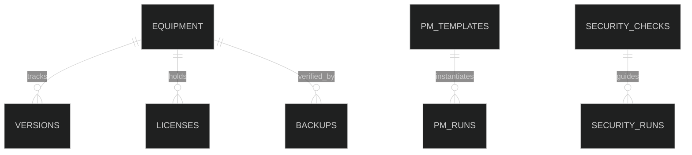

<div align="center">
  <picture>
    
  </picture>
</div>

<div align="center">


**Offline-first PWA for instrumentation & control engineers**  
*Built for Automation & Controls.*

</div>

---

> [!IMPORTANT]
> **Air-Gapped & Offline Ready**
> OpsGuard operates with zero connectivity. Maintenance checklists, audits, and firmware tracking run directly off your device's local IndexedDB. It is designed to work deep inside remote substations or isolated plant buildings.

## 🛠️ Core Capabilities

*   🗓️ **Preventive Maintenance Scheduling:** Persistent, interactive checklists.
*   💾 **Firmware & Software Registry:** Track PLC/HMI/SCADA firmware versions to prevent upgrade mismatches.
*   🔐 **Cybersecurity & Access Audits:** Hardening checklists and default-password audit logs.
*   📜 **License Tracking:** Monitor software support expirations and SSL certificate validity.
*   ✅ **Backup Verification:** Cryptographic hash and success/failure logging for disaster recovery archives.
*   📄 **Compliance PDF Exports:** One-click, branded PDF reports generated entirely client-side using `html2pdf.js`.

---

## 🗄️ Database Schema (IndexedDB)

The local data model utilizes a multi-store approach to keep maintenance logic separated from physical asset tracking. *See `js/db.js` for the exact schema.*



---

## 💻 Tech Stack & Folder Structure

*   **Frontend:** Vanilla JavaScript, HTML5, CSS3 *(No build step, no framework)*.
*   **Storage:** IndexedDB for secure, local offline data.
*   **PWA Layer:** Service Worker with app-shell precache + runtime CDN caching.
*   **Reporting:** `html2pdf.js` loaded via CDN (falls back to native browser print if fully offline on first use).

<details>
<summary><strong>📁 Click to expand the repository structure</strong></summary>

```text
agc-scada-opsguard/
├── index.html          # App shell, hash-router mounts views into #view
├── offline.html        # Fallback page served by the service worker
├── manifest.json       # PWA manifest (icons, shortcuts, theme)
├── sw.js               # Service worker — app-shell + runtime caching
├── css/style.css       # Dark industrial / control-panel design system
├── js/
│   ├── db.js           # IndexedDB wrapper (OpsDB)
│   ├── seed-data.js    # First-run demo dataset
│   ├── pdf-export.js   # Letterhead PDF report builder
│   └── app.js          # Router + all views + CRUD logic
├── icons/              # App icons (all manifest sizes) + favicon
└── social/             # Social sharing / announcement image assets
```
</details>

---

## 🚀 Installation & Deployment

### Run it Locally
Any static file server works. Note: A service worker requires `http://` or `https://` (it will not work directly from a `file://` URL).

```bash
cd agc-scada-opsguard
python3 -m http.server 8080
# Open http://localhost:8080 in your browser
```

### Production Deployment
Upload the folder as-is to any static host (GitHub Pages, Netlify, or an internal IIS/nginx server). **No server-side code or cloud database is required.**

### Install on a Device
1. Open the site in Chrome/Edge (Desktop/Android) or Safari (iOS/iPadOS).
2. Select **"Install app"** or **"Add to Home Screen"**.
3. OpsGuard will launch full-screen as a native application, retaining full functionality with zero signal.

---

> [!NOTE]
> **Application Notes & Maintenance**
> *   **Demo Data:** The first run seeds a baseline dataset (sample PLC/HMI registry, version matrix, security checklist, and a Weekly SCADA Health Check). You can reset this anytime via **Settings → Reset demo data**.
> *   **Data Backups:** Use **Settings → Export all data (JSON)** to create a full local backup of your IndexedDB environment.
> *   **Branding:** Replace `icons/icon-master.svg` and `social/*.svg` with your own artwork to override the default dark/amber SCADA theme.

🚀 Installation & Deployment
Run it Locally
Any static file server works. Note: A service worker requires http:// or https:// (it will not work directly from a file:// URL).

cd agc-scada-opsguard
python3 -m http.server 8080
# Open http://localhost:8080 in your browser

Production Deployment
Upload the folder as-is to any static host (GitHub Pages, Netlify, or an internal IIS/nginx server). No server-side code or cloud database is required.

Install on a Device
Open the site in Chrome/Edge (Desktop/Android) or Safari (iOS/iPadOS).

Select "Install app" or "Add to Home Screen".

OpsGuard will launch full-screen as a native application, retaining full functionality with zero signal.

[!NOTE]
Application Notes & Maintenance

Demo Data: The first run seeds a baseline dataset (sample PLC/HMI registry, version matrix, security checklist, and a Weekly SCADA Health Check). You can reset this anytime via Settings → Reset demo data.

Data Backups: Use Settings → Export all data (JSON) to create a full local backup of your IndexedDB environment.

Branding: Replace icons/icon-master.svg and social/*.svg with your own artwork to override the default dark/amber SCADA theme.
